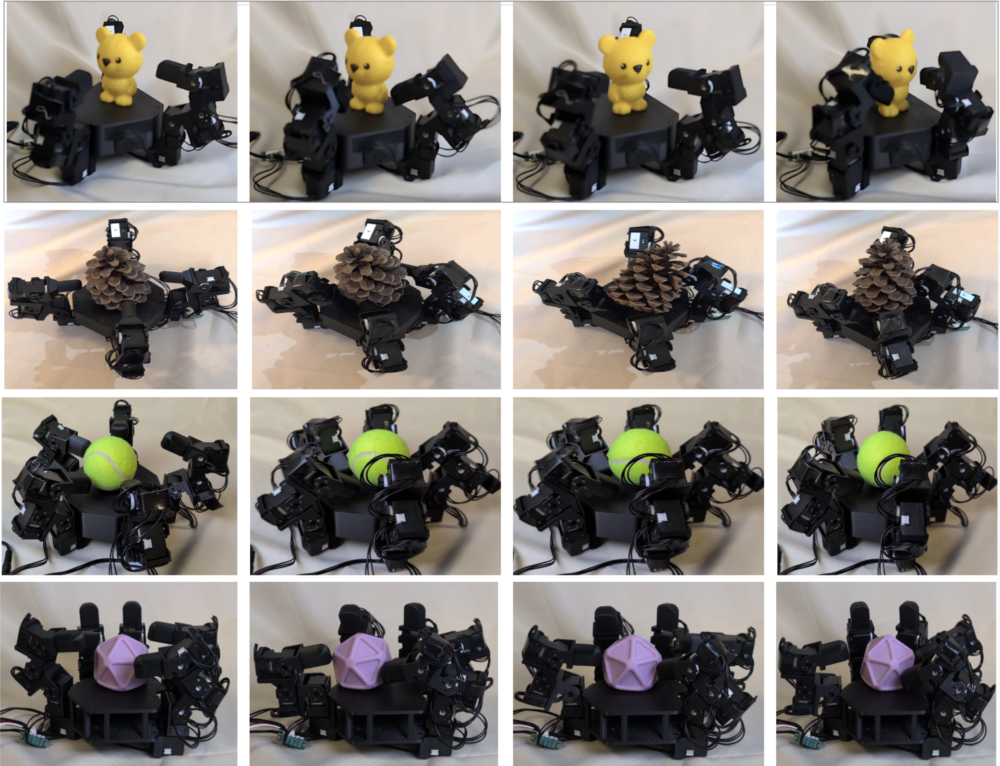

# 🏡 House of Dextra 🦾



You can build multiple hands from one platform, here's the guide!

This guide covers how to build a modular robot hand, and how to alter it to build similar hands. Hand variants are shown on our [website](https://an-axolotl.github.io/HouseofDextra/build_guide).

**Key Features:**
- **Modular:** all electronics and components can be disassembled and re-used into other morphologies. If you are doing co-design or want to quickly prototype changes to robot hands, this is a great starting point
- **Easy to Build:** 3-4 hours to build and deploy the first hand, then less than an hour after printing for each additional robot hand
- **5 Finger Direct Drive:** 5 fingered robot hands (or 3, 4, 5, 6 fingers if you choose). Servo motors allow for easy sim-to-real since the encoders are position accurate

---

## 🛒 Bill of Materials

| Item | Quantity | Price | Notes |
|------|----------|-------|-------|
| [Cables](https://robotis.us/robot-cable-x3p-180mm-10pcs/) | 1 | $38.42 | |
| [Expansion Boards](https://www.robotis.us/3p-jst-expansion-board/) | 2 | $13.80 | |
| [Servo Motors](https://www.robotis.us/dynamixel-xl330-m288-t/) | 20 | $549.80 | 5 finger = 20, 4 fingers = 16, 3 fingers = 12, etc. |
| [U2D2 Power Hub Board](https://www.robotis.us/u2d2-power-hub-boardset/) | 1 | $21.85 | |
| [U2D2 Communication Board](https://www.robotis.us/u2d2/) | 1 | $36.92 | |
| [Power Supply](https://www.amazon.com/ALITOVE-Converter-5-5x2-1mm-100V-240V-Security/dp/B078RT3ZPS) | 1 | $16.49 | |
| [Black PLA](https://us.store.bambulab.com/products/pla-basic-filament) | 1 | $22.99 | Makes it look cool |
| USB 3.0 | 1 | | |
| **Total** | | **$700.27** | |

**Additional tools:** Electrical tape, screwdriver kit, micro cutters (~$31). And a 3D printer that can print PLA 🤖

> **Optional:** For extra-sturdy joints, add [servo horns](https://www.robotis.us/hnx330-n101-set/) for each servo motor.

---

## 🖨️ Print Guide

Use **PLA Basic** with **auto tree branching supports** enabled. All STL files and SolidWorks parts are available **[HERE](#)** *(attach link)*.

| Part | Quantity |
|------|----------|
| Palm | 1 |
| Fingertips | 5 |
| Servo Holders (connecting finger joints) | 15 |
| Lever Holders (mounting fingers to palm) | 5 |
| Servo Washers, Large | 15 |
| Servo Washers, Small | 15 |

When printing is done, remove supports with micro cutters.

---

## 🔧 Assembly

Full assembly instructions with images are at **[the build guide](https://an-axolotl.github.io/HouseofDextra/build_guide)**. At a high level:

1. Connect one servo motor vertically to the L-shaped servo holder
2. Bolt servos into each servo holder (long side down, wire ports exposed)
3. Snap large and small washers together (small inside large) and slide onto the free side of each servo
4. Mount fingertips to the top using the same process
5. Daisy-chain servo motors with X3P cables; secure wires with electrical tape
6. Bolt each assembled finger into the palm's square brackets
7. Connect four fingers to the expansion board and one directly to the U2D2 board
8. Bolt the U2D2 communication hub to the U2D2 power board, connect with one cable
9. Check wiring, plug in power, and turn on

---

## 🚀 Deployment

Install [Dynamixel Wizard](https://emanual.robotis.com/docs/en/software/dynamixel/dynamixel_wizard2/) and connect the U2D2 board via USB 3.0. Run a scan to find all motors, then:

1. **ID each motor** - number them 1-20 starting with the thumb's vertical motor as 1, working up and around each finger
2. **Verify movement** - use the torque slider in Dynamixel Wizard to confirm each motor moves
3. **Tune PID values** - go to Options and set proportional, integral, and derivative values per motor
4. **Set joint limits** - record the servo tick at each desired limit and enter them in the config file (or use the defaults provided in the code)

---

## 💻 Software

### Dependencies

```bash
pip install dynamixel-sdk numpy torch
```

Requires Python 3.8+. Motors communicate over USB via the U2D2 board (`/dev/ttyUSB0` on Linux/Mac, `COM*` on Windows).

---

### `test.py` - Hardware Verification

**Start here.** Verifies motor communication and movement without any policy. Runs a wave motion by default, where each finger bends inward then returns to rest in sequence.

```bash
python test.py --config config/anthro_standard.yaml --test-mode wave
```

**Test modes** (switch live with keyboard):

| Key | Mode | Behavior |
|-----|------|----------|
| `1` | `static` | Hold default pose |
| `2` | `wave` | Wave fingers sequentially (default) |
| `3` | `sine` | Smooth sinusoidal motion on all joints |
| `4` | `incremental` | Step through predefined poses |
| `r` | | Reset to base pose |
| `Space` | | Pause / resume |
| `q` / `ESC` | | Quit (returns to base pose, disables torque) |

```
--config / -c    Path to config file   (default: config/anthro_standard.yaml)
--test-mode / -t Test mode             (default: wave)
--speed / -s     Speed multiplier      (default: 1.0)
```

If all fingers move as expected, you are good to go.

---

### `sync_midpoint_control.py` - Midpoint Oscillation Test

A self-contained lower-level test with no config file. On each keypress, toggles all finger joint motors between their midpoint and lower limit. Useful for quickly checking motor limits and PID response right after first wiring.

```bash
python sync_midpoint_control.py
```

Press any key to toggle; press `ESC` to exit. Motor IDs, limit offsets, and PID gains are hardcoded at the top of the file, edit them directly to match your hand.

> The 5 base/abduction motors (IDs 1, 5, 9, 13, 17) are held at their midpoint throughout; only the finger joint motors oscillate.

---

### `standard_control.py` - Policy Control

This script is the blueprint for running your own sim-to-real policy on the hardware. It handles the full real-time control loop: reading joint positions at the configured frequency, building a history observation, running inference on a TorchScript policy, and sending goal positions back to the motors. If you have trained a policy in simulation and want to deploy it on the hand, this is the file to adapt.

```bash
python standard_control.py \
  --config config/anthro_standard.yaml \
  --policy-path path/to/policy.pt
```

```
--config / -c      Path to config file          (default: config/anthro_standard.yaml)
--policy-path / -p Path to TorchScript .pt file (default: set in config)
```

The script sends the default pose first, then waits for a keypress to activate the policy. Loop timing stats (command Hz, read Hz, bus RTT, missed ticks) are printed every second. Press `q` or `ESC` to exit cleanly, torque is disabled automatically.

---

## 🔁 How to Adapt

- **Add/remove fingers** - Do so in motor ID order to avoid re-IDing
- **Custom palms** - Copy servo mounting brackets from the SolidWorks part onto any new geometry and export as STL
- **Custom fingertips** - Design any shape and connect on top of a lever
- **More fingers** - Add another expansion board for up to 10 fingers
- **Different materials** - PETG, TPU for flex tips, etc.

All components connect and disconnect the same way as the original assembly.

---

## 📖 Citation

If you use this in your research, please cite:

```bibtex
@article{fay2025crossembodied,
  title={House of Dextra: Cross Embodied Co-Design for Dexterous Hands},
  author={Fay, Kehlani and Djapri, Darin and Zorin, Anya and Clinton, James
          and El Lahib, Ali and Su, Hao and Tolley, Michael T. and Yi, Sha
          and Wang, Xiaolong},
  journal={arXiv preprint},
  year={2025},
  month={December}
}
```

---

*All the best, Fay* 🤖

## Motor Position Resolution
Each position tick represents 360°/4096 ≈ 0.088 degrees of rotation.

<details>
<summary><strong>Detailed Motor Configuration Settings</strong></summary>

### Motor Settings Used in Research

**Common Parameters for All Motors:**
- Moving Threshold: 10 (2.29 rev/min, unit is 0.22888 rev/min)
- Temperature Limit: 70°C
- Voltage Range: 3.5V - 7V
- PWM Limit: 100%
- Current Limit: 1750 mA
- Velocity Limit: 445 (101.85 rev/min, unit is 0.22888 rev/min)

---

#### Thumb Motors

**Motor 1:**
- Homing Offset: 0
- Min Limit: 1404 (actual: 856)
- Max Limit: 2315 (actual: 2956)
- Drive Mode: 1
- PID Gains: (1200, 100, 1500)
- Limit Offset: (+548, -641)

**Motor 2:**
- Homing Offset: 0
- Min Limit: 2048 (actual: 1990)
- Max Limit: 3072 (actual: 3370)
- Drive Mode: 1
- PID Gains: (1200, 0, 1500)
- Limit Offset: (+58, -298)

**Motor 3:**
- Homing Offset: 0
- Min Limit: 2048 (actual: 1990)
- Max Limit: 3072 (actual: 3320)
- Drive Mode: 1
- PID Gains: (2500, 0, 3000)
- Limit Offset: (+58, -248)

**Motor 4:**
- Homing Offset: 0
- Min Limit: 2048 (actual: 1990)
- Max Limit: 3072 (actual: 3340)
- Drive Mode: 1
- PID Gains: (2000, 0, 2000)
- Limit Offset: (+58, -268)

---

#### Index Finger Motors

**Motor 5:**
- Homing Offset: 0
- Min Limit: 2616 (actual: 2048)
- Max Limit: 3527 (actual: 4095)
- Drive Mode: 0
- PID Gains: (900, 180, 1500)
- Limit Offset: (+568, -568)

**Motor 6:**
- Homing Offset: 0
- Min Limit: 1024 (actual: 950)
- Max Limit: 2048 (actual: 2300)
- Drive Mode: 1
- PID Gains: (1200, 0, 2000)
- Limit Offset: (+74, -252)

**Motor 7:**
- Homing Offset: 0
- Min Limit: 2048 (actual: 1980)
- Max Limit: 3072 (actual: 3320)
- Drive Mode: 1
- PID Gains: (2500, 0, 6000)
- Limit Offset: (+68, -248)

**Motor 8:**
- Homing Offset: 0
- Min Limit: 2048 (actual: 2000)
- Max Limit: 3072 (actual: 3350)
- Drive Mode: 1
- PID Gains: (2000, 0, 2000)
- Limit Offset: (+48, -278)

---

#### Middle Finger Motors

**Motor 9:**
- Homing Offset: 0
- Min Limit: 1592 (actual: 1024)
- Max Limit: 2503 (actual: 3072)
- Drive Mode: 0
- PID Gains: (900, 0, 1500)
- Limit Offset: (+568, -569)

**Motor 10:**
- Homing Offset: 0
- Min Limit: 1024 (actual: 940)
- Max Limit: 2048 (actual: 2320)
- Drive Mode: 1
- PID Gains: (2500, 100, 6000)
- Limit Offset: (+84, -272)

**Motor 11:**
- Homing Offset: 0
- Min Limit: 2048 (actual: 1990)
- Max Limit: 3072 (actual: 3320)
- Drive Mode: 1
- PID Gains: (2000, 10, 2500)
- Limit Offset: (+58, -248)

**Motor 12:**
- Homing Offset: 0
- Min Limit: 2048 (actual: 1996)
- Max Limit: 3072 (actual: 3342)
- Drive Mode: 1
- PID Gains: (2000, 0, 2000)
- Limit Offset: (+52, -270)

---

#### Ring Finger Motors

**Motor 13:**
- Homing Offset: 0
- Min Limit: 1820 (actual: 1251)
- Max Limit: 2730 (actual: 3299)
- Drive Mode: 1
- PID Gains: (1500, 0, 1500)
- Limit Offset: (+569, -569)

**Motor 14:**
- Homing Offset: 0
- Min Limit: 1024 (actual: 960)
- Max Limit: 2048 (actual: 2300)
- Drive Mode: 1
- PID Gains: (2500, 100, 6000)
- Limit Offset: (+64, -252)

**Motor 15:**
- Homing Offset: 0
- Min Limit: 2048 (actual: 1990)
- Max Limit: 3072 (actual: 3320)
- Drive Mode: 1
- PID Gains: (2000, 10, 2500)
- Limit Offset: (+58, -248)

**Motor 16:**
- Homing Offset: 0
- Min Limit: 0 (actual: 0)
- Max Limit: 1024 (actual: 1300)
- Drive Mode: 1
- PID Gains: (2000, 0, 2000)
- Limit Offset: (0, -266)

---

#### Pinky Finger Motors

**Motor 17:**
- Homing Offset: 512
- Min Limit: 374 (actual: 0)
- Max Limit: 1285 (actual: 1854)
- Drive Mode: 0
- PID Gains: (1500, 0, 1500)
- Limit Offset: (+374, -569)

**Motor 18:**
- Homing Offset: 0
- Min Limit: 3072 (actual: 3000)
- Max Limit: 4095 (actual: 4095)
- Drive Mode: 1
- PID Gains: (2500, 100, 6000)
- Limit Offset: (+72, 0)

**Motor 19:**
- Homing Offset: 0
- Min Limit: 1024 (actual: 1285)
- Max Limit: 2048 (actual: 1787)
- Drive Mode: 1
- PID Gains: (2000, 0, 2500)
- Limit Offset: (0, -261)

**Motor 20:**
- Homing Offset: 0
- Min Limit: 2048 (actual: 1990)
- Max Limit: 3072 (actual: 3350)
- Drive Mode: 1
- PID Gains: (2000, 0, 2000)
- Limit Offset: (+98, -328)

</details>


# Installation
Run ```sudo python python/setup.py install```

# Usage
Verify control movement with ```python sync_midpoint_control.py```

Run policy with ```python run.py```

Specify a policy with ```python run.py --policy-path agents/<.pt>``` or with short form ```python run.py -p agents/<.pt>```

See more options with ```python run.py --help```

# Configuration
All configs can be found in config/config.yaml

Device name can be figured out by running:
```
pip install arduino-cli
arduino-cli core update-index
arduino-cli core install arduino:avr
arduino-cli core list
arduino-cli board list
```

# Note On Robustness
Running the policy on the real hand requires a specific default joint position that the policy was trained under. Number of observations also matters and for now these are the only observations:
1. 3 frames of <joint position normalized between [-1, 1], joint target position in radian space> 
2. One hot encoded vector for the object type between [Sphere, Cross, Cube, Cylinder]
3. Optional: Object state

Current code will need to be modified to allow for robust observation/action space based on hand design.

Also the LEAP Hand Authors chose to use the first part of the frame in [-1, 1] space while the second part is in radians space, so this may have to be changed soon too.


# References
SDK Python Scripts: 
https://emanual.robotis.com/docs/en/software/dynamixel/dynamixel_sdk/sample_code/python_read_write_protocol_2_0/#python-protocol-20

SDK API REFERENCE:
https://emanual.robotis.com/docs/en/software/dynamixel/dynamixel_sdk/api_reference/python/

Python SDK Quick Start Guide:
https://www.youtube.com/watch?v=LAizFTTdL8o

Python SDK Walkthrough:
https://www.youtube.com/watch?v=uHnrLVZEGi4
https://www.youtube.com/watch?v=pZmueNctY0s


# Dynamixel SDK


The ROBOTIS Dynamixel SDK is a software development kit that provides Dynamixel control functions using packet communication. The API is designed for Dynamixel actuators and Dynamixel-based platforms. For more information on Dynamixel SDK, please refer to the e-manual below.
- [ROBOTIS e-Manual for Dynamixel SDK](http://emanual.robotis.com/docs/en/software/dynamixel/dynamixel_sdk/overview/)


